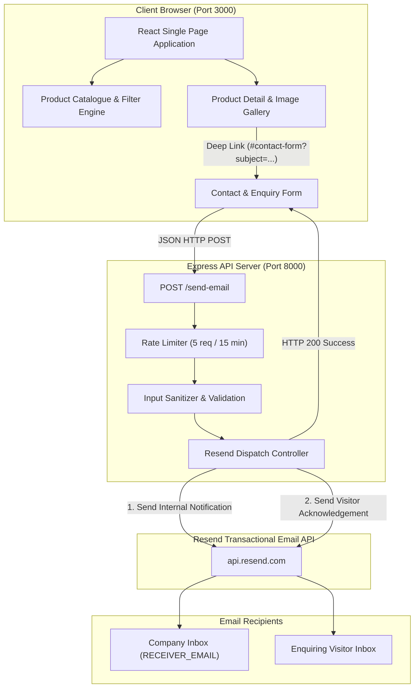

# Nivvis Labs

> Modern pharmaceutical corporate web platform and digital therapeutic catalogue for **Nivvis Labs Private Limited**.

---

## 1. Project Overview

**Nivvis Labs** is a professional corporate web application and digital product catalogue designed to showcase the pharmaceutical formulations, manufacturing quality standards, and clinical therapeutic areas of **Nivvis Labs Private Limited**.

Operating across core chronic healthcare segments in India—such as cardiovascular health, diabetes care, neurology, and pain management—this platform replaces static physical brochures with a high-performance, mobile-responsive, and accessible digital platform. It enables healthcare professionals, distributors, pharmacy networks, and patients to explore detailed product compositions, review packaging specifications, and seamlessly submit inquiries directly to the company.

---

## 2. Key Features

- **Dynamic Product Catalogue:** Comprehensive catalogue of 21 pharmaceutical formulations categorized across 7 distinct therapeutic classes.
- **Instant Search & Category Filtering:** Real-time client-side text search (by brand name, generic formulation, or therapeutic use) combined with category taxonomy filters, synchronized with URL query parameters (`?search=`, `?category=`).
- **Interactive Product Detail & Gallery:** High-resolution product showcase powered by an interactive image carousel (`react-slick`), thumbnail previews, clinical indications, and click-to-enlarge modal inspection.
- **Contextual Product-to-Enquiry Deep-Linking:** One-click _"Enquire About Product"_ CTAs dynamically route visitors to the contact form, smooth-scroll to the anchor (`#contact-form`), and pre-fill the inquiry subject line.
- **Dual-Email Transaction System:** Built-in Resend integration that simultaneously:
  1. Delivers internal inquiry alerts with complete visitor data directly to the company's inbox (`RECEIVER_EMAIL`).
  2. Dispatches an automated, personalized HTML/plain-text confirmation to the visitor's email address.
- **Dynamic Acknowledgement Subjects:** Automatically differentiates general corporate queries from product-specific inquiries (e.g., _"We’ve Received Your Enquiry — Practoglim M2 Forte | Nivvis Labs"_).
- **Enterprise Security Standards:** Strict IP-based rate limiting on inquiry endpoints (5 requests per 15 minutes), comprehensive input length bounds, regex validation, header injection defenses, and HTML entity escaping.
- **Responsive & Mobile-Hardened:** Mobile-first architecture tested and verified across standard viewports (320px, 375px, 425px, 768px, 1024px, 1440px) with zero horizontal overflow.
- **Accessibility (WCAG 2.1 AA):** High-contrast color palette (`#0F4C81` primary blue on `#FFFFFF` surface yields 8.5:1 contrast), visible focus indicators, semantic landmark tags, and descriptive ARIA labels.
- **SEO & Social Graph Integration:** Complete Open Graph and Twitter Card metadata with an integrated 1200×630 branded social preview asset (`/og-image.png`).
- **Modern React Router v6 with v7 Future Opt-In:** Zero console deprecation warnings through enabled `v7_startTransition` and `v7_relativeSplatPath` routing flags.

---

## 3. Technology Stack

### Frontend

- **Core Framework:** React 18.3.1
- **Routing:** React Router DOM 6.23.1 (configured with React Router v7 future flags)
- **Styling & UI Components:** Bootstrap 5.3.3, React-Bootstrap 2.10.2
- **Carousels & Sliders:** React-Slick 0.30.2, Slick-Carousel 1.8.1, React-Multi-Carousel 2.8.5
- **Iconography:** React-Icons 5.2.1
- **Build Tooling:** React Scripts 5.0.1 (Webpack 5), Web Vitals 2.1.4

### Backend API

- **Runtime:** Node.js (v18+ / v22+)
- **Server Framework:** Express.js 4.19.2
- **Email Service SDK:** Resend 6.28.0
- **Rate Limiting:** express-rate-limit 8.7.0
- **Middleware:** CORS 2.8.5, Body-Parser 1.20.2, Dotenv 16.x

### Optimization & Testing

- **Image Processing:** Sharp 0.35.4 (local WebP conversion pipeline)
- **Testing:** Jest, React Testing Library (@testing-library/react 13.4.0, @testing-library/jest-dom 5.17.0)

---

## 4. Application Architecture

The application operates as a decoupled client-server architecture designed for local execution:



---

## 5. Directory Structure

```text
nivvis/
├── public/
│   ├── favicon.ico               # Application favicon
│   ├── index.html                # HTML template, OpenGraph & meta tags
│   ├── manifest.json             # PWA manifest
│   ├── og-image.png              # 1200x630 branded social share preview image
│   ├── robots.txt                # Search engine crawler instructions
│   └── _redirects                # SPA client-side routing fallback rules
├── src/
│   ├── About/
│   │   └── about.js              # Corporate profile, certifications & contact section
│   ├── assets/
│   │   └── optimized/            # WebP optimized UI graphics & product images
│   ├── backend/
│   │   └── server.js             # Express API, rate-limiting & Resend dual-mailer
│   ├── components/
│   │   ├── about/
│   │   │   ├── ContactCards.js   # Direct corporate phone/email/address cards
│   │   │   ├── ContactForm.js    # Controlled contact form with validation state
│   │   │   └── LocationMap.js    # Interactive Google Maps embed for Mumbai office
│   │   ├── home/
│   │   │   ├── CorporateEnquirySection.js
│   │   │   ├── FormulationsSection.js
│   │   │   ├── ProductsCarousel.js
│   │   │   ├── QualitySection.js
│   │   │   ├── ServicesSection.js
│   │   │   └── VisionSection.js
│   │   ├── products/
│   │   │   ├── CategorySection.js    # Therapeutic category product cards
│   │   │   ├── ProductGallery.js     # Image carousel with modal zoom
│   │   │   ├── ProductInformation.js # Composition, dosage form & uses display
│   │   │   └── ProductNotFound.js    # Friendly SKU-not-found recovery state
│   │   └── NotFound.js           # Global 404 error page component
│   ├── Home/
│   │   ├── footer.js             # Global enterprise footer with quick links
│   │   ├── home.js               # Landing page orchestrator
│   │   └── nav.js                # Responsive navigation bar with mobile drawer
│   ├── images/                   # Original and supplementary image assets
│   ├── Products/
│   │   ├── product.js            # Catalogue page with search, filters & grid
│   │   ├── productdetails.js     # Dynamic SKU route (/product/:productName)
│   │   └── productsData.js       # Authoritative dataset for 21 formulations
│   ├── styles/
│   │   ├── catalogue.css         # Catalogue grid, filter pills & search styles
│   │   ├── home.css              # Hero section, feature grids & animation styles
│   │   ├── navbar.css            # Navigation bar, brand lockup & mobile offcanvas
│   │   └── theme.css             # Central design tokens (colors, typography, shadows)
│   ├── App.css                   # Global layout styling
│   ├── App.js                    # Route configuration & scroll restoration
│   ├── App.test.js               # Application smoke and render tests
│   ├── index.css                 # Base resets and utility styles
│   ├── index.js                  # React DOM entry point
│   └── setupTests.js             # Testing library configuration
├── scripts/
│   └── optimize-images.js        # Sharp-based image optimization utility
├── .env.example                  # Environment configuration template
├── .gitignore                    # Git exclusion rules
├── package.json                  # Dependencies, metadata & lifecycle scripts
└── README.md                     # Project documentation
```

---

## 6. Product Catalogue Overview

The platform houses **21 pharmaceutical formulations** organized into **7 core therapeutic categories**:

| Category ID                  | Category Name                    | Featured Formulations                                                                                                                                      |
| :--------------------------- | :------------------------------- | :--------------------------------------------------------------------------------------------------------------------------------------------------------- |
| `anti-hypertension`          | **Anti-Hypertension**            | _Telsyday 40, Telsyday AM, Telsyday CT 40, Telsyday AMH, Telsyday Trio 25, Telsyday Trio 50, Rosufame 10, Rosufame F 10, Rosufame CV 10, Rosufame Gold 10_ |
| `diabetes`                   | **Diabetes**                     | _Practoglim M1, Practoglim M2, Practoglim M2 Forte_                                                                                                        |
| `neuropathic-pain`           | **Neuropathic Pain**             | _Cobastart, Cobastart P, Cobastart XT_                                                                                                                     |
| `pain-management`            | **Pain Management**              | _Gabazest NT_                                                                                                                                              |
| `calcium-vitamin-deficiency` | **Calcium & Vitamin Deficiency** | _Calciniv D3_                                                                                                                                              |
| `lipids`                     | **Lipids**                       | Specialized statin and lipid-lowering therapies                                                                                                            |
| `others`                     | **Others**                       | _Spansave, Spansave DSR, Emcovit Gold_                                                                                                                     |

---

## 7. Contact & Enquiry System

The contact system uses a secure, dual-notification architecture:

```text
Visitor Submits Form
         │
         ▼
[Frontend Validation]  ──► Enforces character limits, email format, and phone regex
         │
         ▼
[POST /send-email]     ──► Express API at http://localhost:8000
         │
         ├─► [Rate Limiter]     ──► Maximum 5 submissions per 15 minutes per IP
         ├─► [Sanitization]     ──► Escapes HTML characters; blocks CRLF header injection
         ├─► [Resend Call 1]    ──► Dispatches internal notification to RECEIVER_EMAIL
         │
         ▼ (Only if Call 1 succeeds)
[Resend Call 2]        ──► Dispatches branded acknowledgement to visitor's email
         │
         ▼
[Frontend Feedback]    ──► Displays confirmation banner; resets input fields
```

### Dynamic Acknowledgement Subjects

- **General Inquiries:** `We’ve Received Your Enquiry — Nivvis Labs`
- **Product Inquiries:** `We’ve Received Your Enquiry — [Product Name] | Nivvis Labs` _(extracted automatically via server-side regex from `Enquiry: [Product Name]`)_

---

## 8. Security & Resilience

- **Environment Isolation:** Sensitive server keys (`RESEND_API_KEY`, `RECEIVER_EMAIL`) remain exclusively on the backend server and are never bundled into client-side code.
- **CORS Origin Filtering:** The backend verifies incoming request headers against the configured `FRONTEND_ORIGIN` (`http://localhost:3000`).
- **IP Rate Limiting:** Enforces an aggressive rate limit of 5 requests per 15-minute window per IP to prevent spam and denial-of-service attempts.
- **Header Injection Mitigation:** Rejects carriage return and newline characters (`\r`, `\n`) in single-line fields (`name`, `email`, `phone`, `subject`).
- **XSS Defense:** Escapes all user inputs (`&`, `<`, `>`, `"`, `'`) before embedding them into outgoing HTML emails.
- **Safe Delivery Handling:** Resend development mode prevents accidental delivery to unverified third parties while fully supporting verified recipient testing.

---

## 9. Environment Variables

Create a `.env` file in the project root by copying `.env.example`:

```bash
cp .env.example .env
```

| Variable            | Scope    | Description                           | Safe Development Example |
| :------------------ | :------- | :------------------------------------ | :----------------------- |
| `PORT`              | Frontend | Port for the React development server | `3000`                   |
| `REACT_APP_API_URL` | Frontend | Target URL for Express API calls      | `http://localhost:8000`  |
| `BACKEND_PORT`      | Backend  | Port for the Express backend server   | `8000`                   |
| `FRONTEND_ORIGIN`   | Backend  | Permitted origin for CORS validation  | `http://localhost:3000`  |
| `RESEND_API_KEY`    | Backend  | API Key from your Resend account      | `re_your_api_key_here`   |
| `EMAIL_FROM`        | Backend  | Verified sender address               | `onboarding@resend.dev`  |
| `RECEIVER_EMAIL`    | Backend  | Destination inbox for inquiries       | `delivered@resend.dev`   |

> [!CAUTION]
> Never commit `.env` or real API keys to version control. The repository's `.gitignore` is configured to prevent accidental commits of local environment secrets.

---

## 10. Local Setup & Execution

### Prerequisites

- **Node.js:** v18.0.0 or higher (tested on Node.js v22)
- **npm:** v9.0.0 or higher

### Installation

1. Clone the repository and navigate to the project root:
   ```bash
   git clone <repository-url>
   cd nivvis
   ```
2. Install all project dependencies:
   ```bash
   npm install
   ```
3. Configure your local environment file:
   ```bash
   copy .env.example .env
   ```

### Starting the Application Locally

The project requires running both the frontend React client and the backend Express server. Open two separate terminal windows:

#### Terminal 1 — Backend API Server

```bash
npm run server
```

_Output:_ `Server running on port 8000`

#### Terminal 2 — Frontend React Application

```bash
npm start
```

_Output:_ Compiles the React application and opens `http://localhost:3000` in your default browser.

---

## 11. Testing & Build Commands

### Automated Test Suite

Runs unit and component tests via Jest and React Testing Library:

```bash
npm test -- --watchAll=false --passWithNoTests
```

### Production Build

Compiles an optimized, minified production build in the `build/` directory:

```bash
npm run build
```

### Image Optimization Utility

Runs the Sharp-based image optimization script to process high-resolution assets:

```bash
npm run optimize-images
```

---

## 12. Project Status & Roadmap

- **Status:** Complete, locally runnable corporate application.
- **Hardening:** Passed full end-to-end verification across responsive layouts, cross-browser compatibility, Resend transactional email integration, and accessibility checks.
- **Hosting Note:** This application is configured and verified for local execution. Cloud hosting, domain mapping, and production deployment configurations have not been deployed.

---

## 13. License

No license has currently been specified for this proprietary codebase. All rights reserved by **Nivvis Labs Private Limited**.
